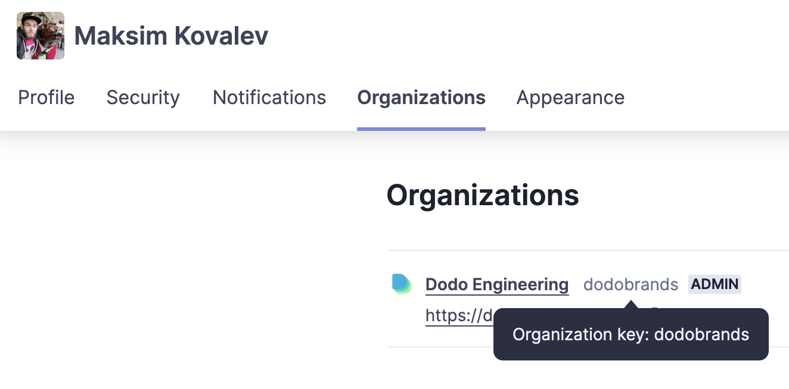
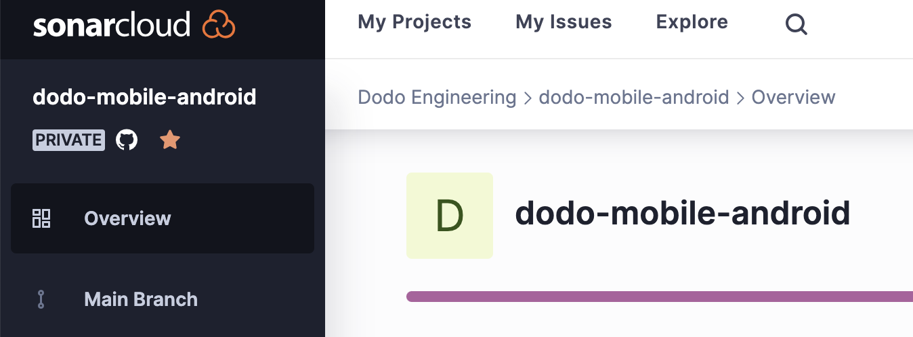

# Настройка SonarCloud в многомодульном Android-приложении

## Создаем проект в SonarCloud

TODO

## Подключаем репозиторий к проекту в SonarCloud

Всю настройку выполняем в корневом `build.gradle`.

Добавляем плагин [SonarQube](https://docs.sonarsource.com/sonarqube/latest/analyzing-source-code/scanners/sonarscanner-for-gradle/):

```groovy
plugins {
  id "org.sonarqube" version "4.4.1.3373"
}
```

Ниже добавляем настройку подключения к SonarCloud:

```groovy
sonar {
  properties {
    property 'sonar.host.url', 'https://sonarcloud.io'
    property 'sonar.organization', '...'
    property 'sonar.projectKey', '...'
    property 'sonar.projectName', '...'
    property 'sonar.projectDescription', ''
  }
}
```

> 💡 Вместо `…` надо вставить значения вашего проекта

Откуда взять значения для свойств:

- `sonar.host.url` - адрес SonarCloud. Всегда [https://sonarcloud.io](https://sonarcloud.io)
- `sonar.organization` - идем на страницу [https://sonarcloud.io/account/organizations](https://sonarcloud.io/account/organizations) и смотрим **Оrganization key** организации, к которой относится ваш проект  (на скриншоте это `dodobrands`).
    
    
    
- `sonar.projectKey` - открываем страницу проекта и видим в строке адреса что-то вроде `https://sonarcloud.io/project/overview?id=тут_название`. Берем значение из query-параметра id.
- `sonar.projectName` - на той же странице проекта берем название из заголовка или бокового меню (на скриншоте это `dodo-mobile-android`)
    
    
    
- `sonar.projectDescription` - описание проекта на его странице. Может быть любым. Можно оставить пустым, но плагин в любом случае требует явно указать его.

> 💡 Помимо конфига плагина любое свойсво можно передавать через [файл gradle.properties](https://docs.sonarsource.com/sonarqube/latest/analyzing-source-code/scanners/sonarscanner-for-gradle/#configure-the-scanner) или параметры при запуске Gradle-таска:
> `./gradlew sonar -Dсвойство=значение`

## Передаем мета-данные приложения

Плагин позволяет указать некоторые мета-данные, чтобы SonarCloud более качественно отображал результаты анализа.

Самые важные из них - версия приложения и название ветки системы контроля версий.

### Версия приложения

Версия позволяет настраивать [критерий для определения нового кода](https://docs.sonarsource.com/sonarqube/latest/project-administration/clean-as-you-code-settings/defining-new-code/#setting-your-new-code-definition), по которому потом можно настраивать [quality gate](https://docs.sonarsource.com/sonarqube/latest/user-guide/quality-gates/) (так например, так можно настроить минимальный требуемый уровень покрытия тестами).

Версия указывается с помощью свойства `sonar.projectVersion`. Удобно, если название версии можно взять прям из Gradle-конфига. Например, у нас есть константа, которая одновременно используется для SonarCloud и для `versionName` приложения.

```groovy
sonar {
  properties {
    // ...
    property 'sonar.projectVersion', rootProject.appVersionName
  }
}
```

### Название ветки системы контроля версий

Название ветки помогает SonarCloud группировать несколько запусков анализа и показывать последний из них. Ещё с помощью названий можно определять ветки, анализ которых не нужно автоматически удалять через 30 дней - это удобно для сохранения подробных исторических данных. У нас, например, так сохраняются данные по каждой релизной ветке.

Название ветки задается свойством `sonar.branch.name` и его тоже можно передать через конфигурацию плагина:

```groovy
sonar {
  properties {
    // ...
    property 'sonar.branch.name', '...'
  }
}
```

В нашем случае так сделать не полчилось, потому что название ветки недоступно из кода приложения. Поэтому мы передаем название ветки отдельным параметром при запуске Gradle-таска:

```bash
./gradlew sonar -Dsonar.branch.name=...
```
